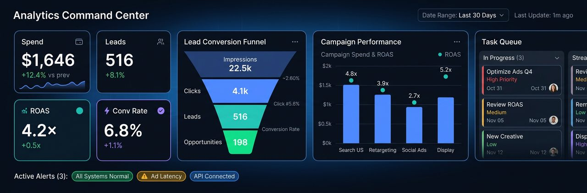
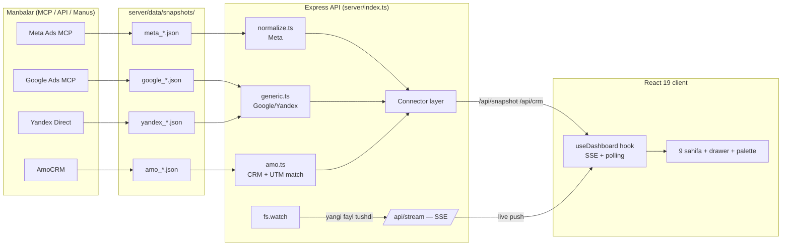

<p align="center">
  
</p>

<h1 align="center">Sof-Expo · Ads Command Center</h1>

<p align="center">
  <b>Reklamadan bitimgacha — bitta dashboardda.</b><br/>
  Meta Ads · Google Ads · Yandex Direct · AmoCRM — to'liq skvoznaya analitika, real-time sync.
</p>

<p align="center">
  
  
  
  
  
</p>

---

## 🎯 Bu nima?

Sof-Expo kompaniyasi uchun **ko'p platformali reklama analitikasi dashboardi**. Maqsad — marketing jarayonining _butun zanjirini_ bitta ekranda ko'rish:

```
Impression → Click → Lead → AmoCRM bosqichlari → Won/Lost → Tushum → ROAS
```

Har bir lead **qaysi kampaniya va kreativdan kelganini**, CRM'da **qaysi bosqichda turganini**, kim **yutib kim yo'qolganini** va qancha **tushum berganini** — hammasi bir joyda, UTM orqali bog'langan holda.

### Nima uchun boshqacha?

- **Faqt real ma'lumot.** Hech qanday demo/uydirma raqam yo'q. Qaytmagan metrika `N/A` deb ochiq ko'rsatiladi, manba cheklovlari alohida ro'yxatda.
- **Snapshot arxitekturasi.** MCP/Manus eksporti papkaga fayl tushgani zahoti dashboard o'zi yangilanadi (fs.watch → SSE). Kod yozish talab qilinmaydi.
- **Signal dvigateli.** Dashboard sizni izlamaydi — u o'zi aytadi: nima buzilgan (risk), nima tekshirish kerak (warn), qayerda pul ko'paytirish mumkin (imkoniyat).

---

## ✨ Imkoniyatlar

| Sahifa                 | Nima bor                                                                                                                                                                                                |
| ---------------------- | ------------------------------------------------------------------------------------------------------------------------------------------------------------------------------------------------------- |
| **/** Umumiy natijalar | 6 KPI karta, skvoznaya voronka (har qadamda konversiya), diqqat signallari, pacing + prognoz, interaksiya/video/messaging metrikalari, CRM yopiq sikl paneli |
| **/campaigns**         | Saralanadigan ledger (Expo filtri, CPL vs o'rtacha benchmark, CSV eksport), detail drawer (15+ metrika)                                                                                                 |
| **/creatives**         | Kreativ reytingi (Spend/CTR/Clicks/CPL), CTR liderlari charti, status chip'lari (ACTIVE/PAUSED/DISAPPROVED)                                                                                             |
| **/audience**          | Yosh segmentlari: spend/leads chart, CPL kesimi, to'liq jadval                                                                                                                                          |
| **/leads**             | Kampaniya tuzilmasi: Expo → Kampaniya → Guruh → Kreativ (yoyiladigan)                                                                                                                                   |
| **/pipeline**          | **Murojaat yo‘li (CRM)**: won/lost/win-rate/ROAS/cost-per-WON, bosqich voronkasi (tannarx bilan), kanban doska, manba atributsiyasi                                                                     |
| **/compare**           | A/B davrlar (% delta), Expo benchmark, account benchmark                                                                                                                                                |
| **/report**            | Rahbariyat uchun bir sahifalik executive brief — «Chop etish → Save as PDF» (dark temada ham yorug' chiqadi)                                                                                            |
| **/connections**       | Qaysi platforma ulangan, ma’lumot qayerdan keladi, manba cheklovlari                                                                                                                                    |

**Umumiy:** ⌘K command palette (sahifa/kampaniya/kreativ/CRM-lead qidiruvi) · dark/light tema · ko'p kabinet tanlagich · live-sync indikator · mobil moslashuv · SSE + polling fallback.

**Tushunarlilik:** har bir sahifa tepasida “bu sahifada nima ko'rasiz” yo'riqnomasi, har bir ko'rsatkich nomi
o'zbekcha + inglizcha qavsda (`Murojaat narxi (CPL)`).

---

## 🚀 Deploy (Vercel va boshqa statik hosting)

`pnpm build:web` ikki ish qiladi:

1. `scripts/build-static-data.ts` — `server/data/snapshots/` ichidagi ma'lumotni normallashtirib
   **`client/public/data/bootstrap.json`** ga yozadi (≈76 KB).
2. `vite build` — client'ni `dist/public` ga yig'adi (statik fayl ham ichida).

Client har doim avval `/api/*` ga murojaat qiladi; **javob kelmasa** (serverless funksiya
ishlamasa, Vercel Deployment Protection bloklasa va h.k.) shu statik fayldan o'qiydi va
yuqori o'ng burchakda _“Build vaqtidagi ma'lumot”_ belgisi chiqadi. Ya'ni UI hech qachon
bo'sh qolmaydi.

Vercel sozlamalari (`vercel.json`):

```
buildCommand:     pnpm build:web
outputDirectory:  dist/public
functions:        api/[[...slug]].ts  (includeFiles: server/data/snapshots/**)
```

Statik rejimda ma'lumotni yangilash uchun — yangi snapshot qo'shib, loyihani qayta deploy qiling
(yoki uzoq muddatli server rejimida ishga tushiring: `pnpm build && pnpm start` — unda SSE live-sync ishlaydi).

## 🏗 Arxitektura



**Normalizatsiya qatlami** — loyihaning yuragi: har qanday platforma `shared/types.ts` dagi umumiy modelga aylantiriladi, UI esa faqat shu model bilan ishlaydi. Yangi platforma qo'shish = yangi normalizer yozish (≈50 satr), UI ga tegmaslik.

---

## 🚀 Ishga tushirish

```bash
pnpm install
pnpm dev        # API (3001) + Vite dev (3000) birga — http://localhost:3000
```

```bash
pnpm build      # production build → dist/
pnpm start      # production: bitta server (client + API), port 3000
pnpm check      # TypeScript strict typecheck
pnpm smoke      # jsdom render test — 37 tekshiruv (barcha sahifalar, drawer, ⌘K)
pnpm audit      # skvoznaya zanjir auditi — real snapshot ustida 11 tekshiruv

# Google Ads API (batafsil pull — Variant A)
pnpm google:oauth           # refresh token olish (docs/google-ads-api-setup.md 3-qadam)
pnpm google:pull            # Google Ads API'dan tortib, google_*.json snapshot yozadi
pnpm google:test:normalize  # offline normalizer tekshiruvi (tarmoq talab qilmaydi)
```

Google Ads API'ni real ulash bo'yicha to'liq bosqichma-bosqich qo'llanma:
[**`docs/google-ads-api-setup.md`**](docs/google-ads-api-setup.md) (Google Cloud →
developer token → OAuth → hosting qarori).

---

## 🔌 Platforma ulash (Manus/MCP)

Hammasi **fayl tushirish** orqali ishlaydi — `server/data/snapshots/` papkasiga:

| Fayl nomi                    | Platforma                   | Taniladigan maydonlar                                                      |
| ---------------------------- | --------------------------- | -------------------------------------------------------------------------- |
| `meta_<act-id>_<davr>.json`  | Meta Ads (istalgan account) | MCP standart eksporti: `account, summary, campaigns, age, ads, adInsights` |
| `google_<id>_<davr>.json`    | Google Ads                  | `rows[]`: `campaign_name, cost_micros, clicks, impressions, conversions`   |
| `yandex_<login>_<davr>.json` | Yandex Direct               | `rows[]`: `Name, Spend, Clicks, Impressions, Conversions`                  |
| `amo_<hisob>_<davr>.json`    | AmoCRM                      | `account, pipelines, stages, leads[]` (utm_campaign!)                      |

Fayl tushgani zahoti: `fs.watch` sezadi → SSE orqali barcha ochiq dashboardlarga push → **sahifa yangilash shart emas**, platforma statusi `READY → LIVE`ga o'tadi.

> **/connections** sahifasida har bir platforma uchun bosqichma-bosqich ulash
> yo'riqnomasi bor: qayerdan boshlash → qanday eksport olish → faylni qanday
> nomlab qayerga tashlash → qanday tekshirish.

> To'liq JSON namunalari: [`server/data/README.md`](server/data/README.md)

### AmoCRM matchlash — muhim qadam

Lead'lar **`utm_campaign`** bo'yicha Meta kampaniyalariga bog'lanadi. Meta'da (bir marta) UTM shabloniga qo'ying:

```
utm_source=facebook&utm_campaign={{campaign.id}}&utm_content={{ad.id}}
```

Bog'lanmagan leadlar "Manbasi aniqlanmagan" deb alohida chiqadi — **taxminiy bog'lash qilinmaydi**.

---

## 📡 API

| Endpoint                          | Tavsif                                                  |
| --------------------------------- | ------------------------------------------------------- |
| `GET /api/snapshot?platform=meta` | Eng yangi snapshot (normalized). `?file=` — aniq fayl   |
| `GET /api/snapshots`              | Mavjud davr/kabinet fayllari ro'yxati (tanlagich uchun) |
| `GET /api/connections`            | Platforma + CRM ulanish holati                          |
| `GET /api/crm`                    | AmoCRM ma'lumoti (matchlangan)                          |
| `GET /api/stream`                 | SSE live-sync kanali (hello/ping/sync eventlari)        |
| `POST /api/refresh`               | Barcha clientlarga push (yangi snapshot haqida)         |
| `GET /api/health`                 | Healthcheck                                             |

---

## 🧠 Signal dvigateli (avtomatik xulosalar)

**Qoidalar:** lead kelmagan sarf (% ulushi) · DISAPPROVED kreativlar · CPL regressiya (>1.5× o'rtacha) · auditoriya charchashi (frequency ≥ 3×) · pauzadagi sarf · zaif CTR · scale imkoniyati (+$100 ≈ +N lead) · ma'lumot to'liqligi

**Anomaliyalar:** robust MAD z-score ≥ 2 — CPL/CPM/CTR/Frequency outayer kampaniyalar

**Pacing:** kunlik sarf/lead, 30 kun prognoz, what-if scale test

Hammasi snapshotdagi real raqamlardan hisoblanadi — qo'lda yozilgan "fact" yo'q.

---

## 🧪 Sifat

- **TypeScript strict** — typecheck toza
- **jsdom smoke-test** — 37/37: barcha 9 sahifa render, drawer ochilishi, ⌘K palette, CRM match kuchi
- **Skvoznaya audit** (`scripts/audit-chain.ts`) — 11 PASS · 0 GAP: Account → Expo → Kampaniya → Ad set → Kreativ → CRM lead zanjiri, referential integrity, metrikalar qamrovi
- **Production build** — muvaffaqiyatli

---

## 🗺 Yo'l xaritasi

- [ ] Google/Yandex uchun ko'p kabinet tanlagich (Meta'da bor)
- [ ] Ko'p platformali CRM atributsiyasi (Google/Yandex leadlarini ham bog'lash)
- [ ] Kunlik timeseries (`time_increment=1`) → trend chartlar, kunlik anomaliyalar
- [ ] Placement/gender/geo kesimlari
- [ ] Browser notification (kritik signallar desktop'ga)
- [ ] Auth + rollar (admin/agent/mijoz), ko'p til (uz/en/ru)
- [ ] Avtomatik email hisobot (haftalik PDF)

---

## 📚 Hujjatlar

- [`server/data/README.md`](server/data/README.md) — snapshot formatlari + Manus/MCP uchun namunalar
- [`todo.md`](todo.md) — bajarilganlar va reja
- [`ideas.md`](ideas.md) — dizayn qarorlari tarixi

## 🛠 Texnologiyalar

React 19 · Vite 7 · TypeScript (strict) · Tailwind 4 · Recharts · Express · SSE (Server-Sent Events) · jsdom (test) · pnpm

---

<p align="center">
  <b>Sof-Expo · Elmun Technologies</b><br/>
  <sub>Raqamni qarorga aylantiradigan dashboard.</sub>
</p>
