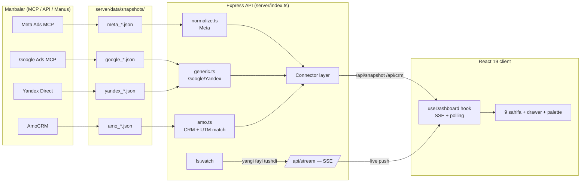

<p align="center">
  
</p>

<h1 align="center">Sof-Expo · Ads Command Center</h1>

<p align="center">
  <b>Reklamadan bitimgacha — bitta dashboardda.</b><br/>
  Meta Ads · Google Ads · Yandex Direct · AmoCRM — to'liq skvoznaya analitika, real-time sync.
</p>

<p align="center">
  
  
  
  
  
</p>

---

## 🎯 Bu nima?

Sof-Expo kompaniyasi uchun **ko'p platformali reklama analitikasi dashboardi**. Maqsad — marketing jarayonining _butun zanjirini_ bitta ekranda ko'rish:

```
Impression → Click → Lead → AmoCRM bosqichlari → Won/Lost → Tushum → ROAS
```

Har bir lead **qaysi kampaniya va kreativdan kelganini**, CRM'da **qaysi bosqichda turganini**, kim **yutib kim yo'qolganini** va qancha **tushum berganini** — hammasi bir joyda, UTM orqali bog'langan holda.

### Nima uchun boshqacha?

- **Faqt real ma'lumot.** Hech qanday demo/uydirma raqam yo'q. Qaytmagan metrika `N/A` deb ochiq ko'rsatiladi, manba cheklovlari alohida ro'yxatda.
- **Real-time sync dvigateli.** Server ulangan manbalardan (Meta Graph API, Google Ads API, TGStat) o'zi ma'lumot tortadi — har `SYNC_INTERVAL_SEC` (default 5 daqiqa) da yoki "Yangilash" tugmasi bilan hoziroq. AmoCRM webhook'i ulansa yangi murojaatlar dashboardga **soniyalar ichida** tushadi (SSE). Kod yozish talab qilinmaydi.
- **Snapshot arxitekturasi.** MCP/Manus eksporti papkaga fayl tushgani zahoti dashboard o'zi yangilanadi (fs.watch → SSE).
- **Signal dvigateli.** Dashboard sizni izlamaydi — u o'zi aytadi: nima buzilgan (risk), nima tekshirish kerak (warn), qayerda pul ko'paytirish mumkin (imkoniyat).

---

## ✨ Imkoniyatlar

| Sahifa                 | Nima bor                                                                                                                                                                                                |
| ---------------------- | ------------------------------------------------------------------------------------------------------------------------------------------------------------------------------------------------------- |
| **/** Umumiy natijalar | 6 KPI karta, **platformalar kesimi** (pul qaysi kanalda — Meta/Google/Yandex/Telegram/Offline), **jonli harakat feed'i** (real-time), **kunlik dinamika charti** (real-time rejimda), skvoznaya voronka, diqqat signallari, pacing + prognoz, CRM yopiq sikl paneli |
| **/campaigns**         | Saralanadigan ledger (Expo filtri, CPL vs o'rtacha benchmark, CSV eksport), detail drawer (15+ metrika)                                                                                                 |
| **/creatives**         | Kreativ reytingi (Spend/CTR/Clicks/CPL), CTR liderlari charti, status chip'lari (ACTIVE/PAUSED/DISAPPROVED)                                                                                             |
| **/audience**          | Yosh segmentlari: spend/leads chart, CPL kesimi, to'liq jadval                                                                                                                                          |
| **/leads**             | Kampaniya tuzilmasi: Expo → Kampaniya → Guruh → Kreativ (yoyiladigan)                                                                                                                                   |
| **/pipeline**          | **Murojaat yo‘li (CRM)**: won/lost/win-rate/ROAS/cost-per-WON, bosqich voronkasi (tannarx bilan), kanban doska, manba atributsiyasi                                                                     |
| **/compare**           | A/B davrlar (% delta), Expo benchmark, account benchmark                                                                                                                                                |
| **/report**            | Rahbariyat uchun bir sahifalik executive brief — «Chop etish → Save as PDF» (dark temada ham yorug' chiqadi)                                                                                            |
| **/connections**       | Qaysi platforma ulangan, ma’lumot qayerdan keladi, manba cheklovlari                                                                                                                                    |

**Umumiy:** ⌘K command palette (sahifa/kampaniya/kreativ/CRM-lead qidiruvi) · dark/light tema · ko'p kabinet tanlagich · **live indikator (LIVE · keyingi syncgacha countdown)** · **desktop bildirishnomalar** (kritik signallar + yangi murojaatlar) · **shaffoflik paneli** (nima ma'lum / nima noma'lum va nega) · tab fokusga qaytganda darhol yangilanish · mobil moslashuv · SSE + 30s polling fallback.

**Tushunarlilik:** har bir sahifa tepasida “bu sahifada nima ko'rasiz” yo'riqnomasi, har bir ko'rsatkich nomi
o'zbekcha + inglizcha qavsda (`Murojaat narxi (CPL)`).

---

## 🚀 Deploy (Vercel va boshqa statik hosting)

`pnpm build:web` ikki ish qiladi:

1. `scripts/build-static-data.ts` — `server/data/snapshots/` ichidagi ma'lumotni normallashtirib
   **`client/public/data/bootstrap.json`** ga yozadi (≈76 KB).
2. `vite build` — client'ni `dist/public` ga yig'adi (statik fayl ham ichida).

Client har doim avval `/api/*` ga murojaat qiladi; **javob kelmasa** (serverless funksiya
ishlamasa, Vercel Deployment Protection bloklasa va h.k.) shu statik fayldan o'qiydi va
yuqori o'ng burchakda _“Build vaqtidagi ma'lumot”_ belgisi chiqadi. Ya'ni UI hech qachon
bo'sh qolmaydi.

Vercel sozlamalari (`vercel.json`):

```
buildCommand:     pnpm build:web
outputDirectory:  dist/public
functions:        api/[[...slug]].ts  (includeFiles: server/data/snapshots/**)
```

Statik rejimda ma'lumotni yangilash uchun — yangi snapshot qo'shib, loyihani qayta deploy qiling
(yoki uzoq muddatli server rejimida ishga tushiring: `pnpm build && pnpm start` — unda SSE live-sync ishlaydi).

## 🏗 Arxitektura



**Normalizatsiya qatlami** — loyihaning yuragi: har qanday platforma `shared/types.ts` dagi umumiy modelga aylantiriladi, UI esa faqat shu model bilan ishlaydi. Yangi platforma qo'shish = yangi normalizer yozish (≈50 satr), UI ga tegmaslik.

---

## 🚀 Ishga tushirish

```bash
pnpm install
pnpm dev        # API (3001) + Vite dev (3000) birga — http://localhost:3000
```

```bash
pnpm build      # production build → dist/
pnpm start      # production: bitta server (client + API), port 3000
pnpm check      # TypeScript strict typecheck
pnpm smoke        # jsdom render test — 46 tekshiruv (barcha sahifalar, drawer, ⌘K, OAuth paneli, kabinet tanlagich)
pnpm test:connect # ulanish oqimi testi — 55 tekshiruv (app kalitlari, OAuth start, token bilan ulash, Telegram, fayl yuklash)
pnpm audit:chain  # skvoznaya zanjir auditi — real snapshot ustida 11 tekshiruv

# Google Ads API (batafsil pull — Variant A)
pnpm google:oauth           # refresh token olish (docs/google-ads-api-setup.md 3-qadam)
pnpm google:pull            # Google Ads API'dan tortib, google_*.json snapshot yozadi
pnpm google:test:normalize  # offline normalizer tekshiruvi (tarmoq talab qilmaydi)
```

### `pnpm test:connect` — ulanish oqimi testi

`scripts/connect-flow-test.ts` butun ulanish zanjirini **haqiqiy server kodi** bilan
tekshiradi. Tashqi API'lar (`graph.facebook.com`, `googleapis.com`, `amocrm.ru`,
`api.tgstat.ru`) `fetch` stub orqali **mock** qilinadi — sandbox/CI'da ularga chiqish
bloklangan, lekin route → `oauthApps` → `store` → sync dvigateli → snapshot fayli →
`/api/connections` payload zanjiri haqiqiy.

Qamrab olinadi: app kalitlari holati (maydon darajasida `missing`) va saqlash/niqoblash,
OAuth start (`redirect_uri` = `PUBLIC_ORIGIN`; kalitsiz holatda tushunarli 400 sahifasi),
token bilan ulash (Meta: yaroqsiz/bo'sh token, aniq kabinet, dedupe · Google: app kalitsiz
va yaroqsiz refresh holatlari · AmoCRM: subdomain tozalash, yaroqsiz hisob), ulangandan
keyingi **darhol sync** (snapshot fayllari yozilganini diskdan tekshiradi), Telegram
tokenini `usage/stat` orqali tekshirish va kanal qo'shish, eksport fayl yuklash (nom
sanitariyasi, path traversal, buzilgan format, JSON bo'lmagan matn, bo'sh fayl, o'chirish),
kabinet toggle, ulanishni o'chirish va kalitlarning `store.json`da saqlanishi (client
payload'iga sizmasligi). Test vaqtinchalik papka ishlatadi (`SNAPSHOTS_DIR`) va oxirida
tozalaydi — repo fayllariga tegmaydi.

Google Ads API'ni real ulash bo'yicha to'liq bosqichma-bosqich qo'llanma:
[**`docs/google-ads-api-setup.md`**](docs/google-ads-api-setup.md) (Google Cloud →
developer token → OAuth → hosting qarori).

---

## 🔌 Platforma ulash (Manus/MCP)

Hammasi **fayl tushirish** orqali ishlaydi — `server/data/snapshots/` papkasiga:

| Fayl nomi                    | Platforma                   | Taniladigan maydonlar                                                      |
| ---------------------------- | --------------------------- | -------------------------------------------------------------------------- |
| `meta_<act-id>_<davr>.json`  | Meta Ads (istalgan account) | MCP standart eksporti: `account, summary, campaigns, age, ads, adInsights` |
| `google_<id>_<davr>.json`    | Google Ads                  | `rows[]`: `campaign_name, cost_micros, clicks, impressions, conversions`   |
| `yandex_<login>_<davr>.json` | Yandex Direct               | `rows[]`: `Name, Spend, Clicks, Impressions, Conversions`                  |
| `amo_<hisob>_<davr>.json`    | AmoCRM                      | `account, pipelines, stages, leads[]` (utm_campaign!)                      |

Fayl tushgani zahoti: `fs.watch` sezadi → SSE orqali barcha ochiq dashboardlarga push → **sahifa yangilash shart emas**, platforma statusi `READY → LIVE`ga o'tadi.

> **/connections** sahifasida har bir platforma uchun bosqichma-bosqich ulash
> yo'riqnomasi bor: qayerdan boshlash → qanday eksport olish → faylni qanday
> nomlab qayerga tashlash → qanday tekshirish.

> To'liq JSON namunalari: [`server/data/README.md`](server/data/README.md)

## 🔗 O'z hisoblaringizni ulang (OAuth — V4.0)

Fayl tashlash endi ixtiyoriy: **Ulanishlar** sahifasida bitta tugma bilan o'z
hisoblaringizni ulaysiz — tokenlar serverda saqlanadi, har sync'da ma'lumot
o'zi tortiladi. Bu rejim **barcha loyihalaringiz** uchun: istalgan vaqt yangi
kabinet ulanadi, tepadagi **kabinet tanlagich**dan xohlagan hisob ko'riladi.

| Platforma | Tugma | App kalitlari (OAuth uchun) | Redirect URL (app sozlamasida) |
| --------- | ----- | --------------------------- | ------------------------------ |
| Facebook / Instagram | «Facebook bilan ulash» | `META_APP_ID` + `META_APP_SECRET` | https://<host>/api/oauth/meta/callback |
| Google Ads | «Google bilan ulash» | `GOOGLE_ADS_CLIENT_ID/SECRET/DEVELOPER_TOKEN` | https://<host>/api/oauth/google-ads/callback |
| AmoCRM | «AmoCRM hisobini ulash» (subdomain kiritiladi) | `AMOCRM_CLIENT_ID/SECRET` | https://<host>/api/oauth/amocrm/callback |
| Telegram (TGStat) | «TGStat tokenini kiritish» (OAuth yo'q — faqat token) | `TGSTAT_TOKEN` | — (callback kerak emas) |

**Tugmalar har doim bosiladi.** App kalitlari bo'lmasa tugma «o'lik» turmaydi —
bosilganda sozlash oynasi ochiladi va ikki yo'lni taklif qiladi:

1. **App kalitlarini UI'dan kiritish** (`.env` tahrirlash, serverni qayta ishga
   tushirish shart emas). Kalitlar `server/data/store.json` ga yoziladi va
   `.env` dagi qiymatlar bilan birlashtirilib o'qiladi. Saqlagach tugma darhol
   OAuth dialogni ochadi. Oynada provider sozlamasiga yoziladigan **redirect URI**
   ham tayyor turadi (bir klikda nusxa olinadi).
2. **«Token bilan ulash»** — app yaratishga vaqt yo'q bo'lsa:
   | Platforma | Nima kiritiladi | Qayerdan olinadi |
   | --------- | --------------- | ---------------- |
   | Meta | access token (+ ixtiyoriy `act_` id) | Business Settings → System Users → token (`ads_read`) yoki Graph API Explorer |
   | Google Ads | refresh token (+ client id/secret, developer token) | `pnpm google:oauth` yoki OAuth Playground |
   | AmoCRM | subdomain + access token | Sozlamalar → Integratsiyalar → «API kalitlari» |

   Token serverda **haqiqiy API so'rovi bilan tekshiriladi** (kabinetlar ro'yxati
   olinadi), xato bo'lsa aniq xabar qaytadi; to'g'ri bo'lsa ulanish saqlanadi va
   ma'lumot **shu zahoti** tortiladi (interval kutilmaydi).

**3. Telegram (TGStat)** — OAuth talab qilmaydi, faqat API tokeni:
`tgstat.ru → Личный кабинет → API token` ni Ulanishlar sahifasidagi «Telegram»
kartasidan kiritasiz (yoki `TGSTAT_TOKEN` env). Saqlashda server tokenni
`GET https://api.tgstat.ru/usage/stat` orqali tekshiradi — bu metod **tariflanmaydi**
(kvota sarflanmaydi) va javobda tarif nomi, muddati hamda sarflangan so'rovlar
ko'rsatiladi. Keyin «Telegram kanallar» sahifasida kanal @username'lari kiritiladi.

**4. Eksport faylni browser'dan yuklash** — hosting'da papkaga qo'lda fayl
tashlab bo'lmasa (SSH yo'q), Ulanishlar sahifasidagi «Eksport faylni yuklash»
panelidan drag&drop bilan yuklanadi. Fayl **yozilishdan oldin** normalizer orqali
tekshiriladi (format tanilmasa yoki ma'lumot bo'sh bo'lsa — aniq xato, papkaga
buzilgan fayl tushmaydi), yozilgach `fs.watch` darhol sezadi va barcha ochiq
dashboardlar SSE orqali yangilanadi. Nomlash qoidalari:

```
meta_act-<id>_<davr>.json · google_<id>_<davr>.json · yandex_<login>_<davr>.json · amo_<hisob>_<davr>.json
```

Qanday ishlaydi:

1. Admin app kalitlarini **`.env` ga yoki Ulanishlar sahifasidagi «Sozlash» oynasiga** qo'yadi.
2. Har bir foydalanuvchi o'z hisobini ulaydi: consent (yoki token) → tokenlar
   `server/data/store.json` ga (gitignore'da) yoziladi — **client'ga hech qachon yuborilmaydi**
   (UI'da faqat niqoblangan ko'rinishi ko'rinadi).
3. Ulanishdan keyin darhol bir martalik sync ketadi, keyin sync dvigateli har
   `SYNC_INTERVAL_SEC` da tortadi: Meta — `act_*` bo'yicha, Google — har customer id,
   AmoCRM — v4 API (leadlar + pipeline).
4. Ulangan kabinetlarni chip'lar bilan yoqib/o'chirib qo'yish mumkin (o'chirilgani sync qilinmaydi);
   har ulanishda **«Hoziroq tortish»** tugmasi bor.
5. Qayta ulanganda eski yozuv ustidan yoziladi (bir xil hisob ikki marta ko'paymaydi).
6. Token eskirsa — status «TOKEN ESKIRGAN» bo'ladi, bir klikda qayta ulanadi.

> **Meta app:** developers.facebook.com da Business tipidagi app yarating,
> `ads_read` + `business_management` scope'lari bilan. O'z hisoblaringiz uchun
> app'ni Development rejimida qoldirish kifoya (o'zingizni developer/test user
> qilib qo'shasiz). Boshqa odamlar hisobini ulashi uchun App Review kerak.
>
> **Google:** `docs/google-ads-api-setup.md` bo'yicha OAuth client + developer token.
> `prompt=consent` bilan refresh token olinadi va avtomatik yangilanadi.

Xavfsizlik: OAuth callbacklar HMAC-imzolangan `state` (CSRF) bilan himoyalangan;
ulanishlarni boshqarish (toggle, delete) umumiy parol auth ostida.

### ⚠ «Server xatosi (404)» — App ID / App Secret saqlanmayapti

App ID va App Secret ni «Sozlash» oynasiga yozib «Saqlash» bosilganda
**`Server xatosi (404)`** chiqsa — bu **kalitlar noto'g'ri** degani emas.
404 deyarli har doim bitta narsani anglatadi: browser'dagi
`POST /api/oauth/apps/meta` so'rovi **Express serverga yetib bormagan**.

| Javob | Nima bo'lgan | Yechim |
| ----- | ------------ | ------ |
| Javob HTML / `vercel.com/login` ga redirect, `sso_required` | **Vercel Deployment Protection** yoqilgan — `/api/*` funksiyaga **umuman yetib bormaydi** (eng keng tarqalgan sabab) | Vercel → Project → Settings → **Deployment Protection** → «Vercel Authentication» ni **«Only Preview Deployments»** ga o'zgartiring (yoki o'chiring) → qayta deploy |
| 404 + **HTML** sahifa | Sayt **statik rejimda**: `/api/*` ni ushlaydigan server yo'q (GitHub Pages / Netlify statik / Vercel'da serverless funksiya deploy bo'lmagan) | Loyihani server bilan ishga turing: `pnpm dev` (lokal) yoki `pnpm build && pnpm start`. Vercel'da `api/[[...slug]].ts` funksiyasi borligini tekshiring |
| 404 + **JSON** (`API manzili topilmadi…`) | Server **eski versiyada** — bunday route unda yo'q | Qayta build + deploy/restart bering |
| 500 + `text/plain` | Dev'da faqat **web** server ishga tushgan (`pnpm dev:web`), API (3001) o'chiq | `pnpm dev` ni ishlating — u web + api ni birga ko'taradi |
| `fetch failed` / aloqa yo'q | API server umuman ishga tushmagan | `pnpm dev:api` loglarini tekshiring |
| 401 `authRequired` | `DASHBOARD_PASSWORD` yoqilgan | Sahifani yangilab, parol bilan kiring |

Ulanishlar sahifasida va «Sozlash» oynasida **API server holati** ko'rsatiladi
(`/api/health` tekshiriladi): server javob bermasa qizil banner chiqadi va nima
qilish kerakligi yoziladi — 404 ni kutib o'tirish shart emas.

**Muqobil yo'l (UI ishlamasa ham):** kalitlarni `.env` ga yozing va serverni
qayta ishga tushiring — ikkala manba birlashtirilib o'qiladi:

```bash
META_APP_ID=1789456123098765
META_APP_SECRET=...
```

Tez tekshirish (server tirikmi?):

```bash
curl http://localhost:3001/api/health
# {"ok":true,"mode":"server",...}  → server ishlayapti
curl -X POST http://localhost:3001/api/oauth/apps/meta \
  -H 'Content-Type: application/json' \
  -d '{"appId":"...","appSecret":"..."}'
# {"ok":true,"ready":true,...}     → kalitlar saqlandi
```

### AmoCRM matchlash — muhim qadam

Lead'lar **`utm_campaign`** bo'yicha Meta kampaniyalariga bog'lanadi. Meta'da (bir marta) UTM shabloniga qo'ying:

```
utm_source=facebook&utm_campaign={{campaign.id}}&utm_content={{ad.id}}
```

Bog'lanmagan leadlar "Manbasi aniqlanmagan" deb alohida chiqadi — **taxminiy bog'lash qilinmaydi**.

---

## 📡 API

| Endpoint                          | Tavsif                                                  |
| --------------------------------- | ------------------------------------------------------- |
| `GET /api/snapshot?platform=meta` | Eng yangi snapshot (normalized). `?file=` — aniq fayl, `?account=` — kabinet filtri |
| `GET /api/oauth/status`            | Qaysi platformalar tayyor: `ready`, `missing[]`, `source` (env/store), niqoblangan qiymatlar |
| `GET /api/oauth/apps`              | App kalitlari holati (maydon darajasida) + UI uchun sozlash retsepti |
| `GET /api/oauth/apps/redirect-uris`| Provider sozlamasiga yoziladigan aniq callback URL'lar |
| `POST /api/oauth/apps/<p>`         | App kalitlarini **UI'dan** saqlash (partial; restart shart emas) |
| `DELETE /api/oauth/apps/<p>`       | Saqlangan kalitlarni o'chirish (`.env` qiymatlari qoladi) |
| `POST /api/oauth/<p>/token`        | **Token bilan ulash** — kalit tekshiriladi, hisob saqlanadi, darhol sync |
| `POST /api/oauth/sync/<p>`         | Bitta platformani hoziroq tortish (interval kutmasdan) |
| `GET /api/oauth/<p>/start`         | OAuth consent sahifasiga redirect (meta/google-ads/amocrm) |
| `GET /api/oauth/<p>/callback`      | Provider'dan qaytgan kod → tokenlar serverda saqlanadi |
| `POST /api/oauth/accounts/:cid/:aid/toggle` | Kabinetni sync'dan yoqish/o'chirish |
| `DELETE /api/oauth/connections/:id` | Ulanishni olib tashlash                                 |
| `GET /api/snapshots`              | Mavjud davr/kabinet fayllari ro'yxati (tanlagich uchun) |
| `GET /api/snapshots/all`          | Barcha fayllar (amo_* ham) + papka yoziladiganmi (`writable`) |
| `POST /api/snapshots`             | **Eksport faylni yuklash** — tekshiriladi, yoziladi, SSE push ketadi |
| `DELETE /api/snapshots/:file`     | Snapshot faylini o'chirish (faqat papkadagi .json) |
| `POST /api/telegram/channels`     | Telegram kanal qo'shish (@username) — TGStat'dan statistika tortiladi |
| `GET /api/connections`            | Platforma + CRM ulanish holati                          |
| `GET /api/crm`                    | AmoCRM ma'lumoti (matchlangan)                          |
| `GET /api/stream`                 | SSE live kanali: hello/ping/sync + **sync_state** + **activity** eventlari |
| `POST /api/sync`                  | Haqiqiy sync — sozlangan manbalardan hoziroq tortadi (Meta/Google/Telegram) |
| `GET /api/sync`                   | Sync dvigateli holati: interval, keyingi sync, natijalar |
| `GET /api/activity`               | Jonli harakat feed'i — sync, yangi leadlar, webhooklar |
| `POST /api/webhooks/amocrm`       | AmoCRM real-time webhook — leadlar darhol CRM + feed'ga tushadi |
| `POST /api/refresh`               | Barcha clientlarga push (yangi snapshot haqida)         |
| `GET /api/health`                 | Healthcheck                                             |

---

## ⚡ Real-time: sync dvigateli + webhooklar

Ma'lumot ikki yo'lda jonli yangilanadi — fayl tashlash shart emas:

| Manba | Real-time usul | Sozlash |
| --- | --- | --- |
| **Meta Ads** | Graph API'dan avtomatik pull (har intervalda) | `.env`: `META_ACCESS_TOKEN`, `META_AD_ACCOUNT_ID` |
| **Google Ads** | API'dan avtomatik pull | `.env`: `GOOGLE_ADS_*` (qo'llanma: `docs/google-ads-api-setup.md`) |
| **Telegram** | TGStat'dan avtomatik pull (kanallar + postlar) | `.env`: `TGSTAT_TOKEN` + kanal qo'shish |
| **AmoCRM** | Webhook push (leadlar soniyalar ichida) | AmoCRM → Webhook'lar → `https://<host>/api/webhooks/amocrm` |
| **Offline** | API orqali qo'lda kiritish | `/offline` sahifasi yoki `POST /api/channels/offline/*` |
| **Har qanday manba** | Snapshot fayl tushishi | `server/data/snapshots/` (fs.watch → SSE) |

- **Interval**: `SYNC_INTERVAL_SEC` (default 300 = 5 daqiqa, minimum 30).
- **Qo'lda sync**: tepadagi ↻ tugma yoki `POST /api/sync` — barcha manbalardan hoziroq tortadi.
- **Jonli harakat feed'i**: har bir sync/lead/webhook hodisasi Overview'da real-time ko'rinadi (SSE `activity` eventlari).
- **Transparenslik**: qaysi manba sozlangan, qaysi ma'lumot bor/yo'q — Overview'dagi platformalar kesimi va /api/sync javobida aniq ko'rsatiladi.
- Ma'lumotlar `server/data/store.json` (yengil JSON store) da saqlanadi — tashqi DB talab qilinmaydi.

## 🔒 Xavfsizlik (ixtiyoriy)

Ochiq URL'da deploy qilganda dashboardni parol bilan himoyalang — `.env` ga:

```
DASHBOARD_PASSWORD=...      # login ekrani yoqiladi
AUTH_SECRET=...             # sessiya imzosi (random satr; ixtiyoriy)
WEBHOOK_SECRET=...          # AmoCRM webhook faqat ?secret=... bilan qabul qilinadi
```

- Sessiya: 30 kun, HttpOnly cookie, HMAC imzolangan; parol timing-safe tekshiriladi.
- `/api/health` ochiq (monitoring uchun), `/api/webhooks/*` — alohida `WEBHOOK_SECRET` bilan.
- Statik zaxira (bootstrap.json) parol so\'ralganda ishlatilmaydi — himoya chetlab o\'tilmaydi.

## 🧠 Signal dvigateli (avtomatik xulosalar)

**Qoidalar:** lead kelmagan sarf (% ulushi) · DISAPPROVED kreativlar · CPL regressiya (>1.5× o'rtacha) · auditoriya charchashi (frequency ≥ 3×) · pauzadagi sarf · zaif CTR · scale imkoniyati (+$100 ≈ +N lead) · ma'lumot to'liqligi

**Anomaliyalar:** robust MAD z-score ≥ 2 — CPL/CPM/CTR/Frequency outayer kampaniyalar

**Pacing:** kunlik sarf/lead, 30 kun prognoz, what-if scale test

Hammasi snapshotdagi real raqamlardan hisoblanadi — qo'lda yozilgan "fact" yo'q.

---

## 🧪 Sifat

- **TypeScript strict** — typecheck toza
- **jsdom smoke-test** — 46/46: barcha sahifalar render, drawer ochilishi, ⌘K palette, CRM match kuchi, OAuth paneli, kabinet tanlagich
- **Skvoznaya audit** (`scripts/audit-chain.ts`) — 11 PASS · 0 GAP: Account → Expo → Kampaniya → Ad set → Kreativ → CRM lead zanjiri, referential integrity, metrikalar qamrovi
- **Production build** — muvaffaqiyatli

---

## 🗺 Yo'l xaritasi

- [x] Yagona oyna: platformalar kesimi Overview'da (Meta/Google/Yandex/Telegram/Offline bir joyda) — V3.
- [x] Ko'p kabinet: bir platformaning barcha hisoblari avtomatik jamlanadi (V3.3); aniq davr/kabinet tanlash — tepadagi tanlagich.
- [x] Kunlik timeseries (Meta `time_increment=1`) → trend chartlar — V3.1.
- [x] Desktop bildirishnomalar + signal shaffoflik paneli — V3.2.
- [x] Parol himoyasi + webhook secret — V3.3.
- [x] **OAuth ko'p ijarachilik (multi-tenant)**: o'z Facebook/Google/AmoCRM hisoblarini bitta tugma bilan ulash, kabinet tanlagich, tokenlar serverda — V4.0.
- [ ] Yandex Direct API pull (hozir fayl orqali)
- [ ] Ko'p platformali CRM atributsiyasi (Google/Yandex leadlarini ham bog'lash)
- [ ] Rollar (admin/agent/mijoz), ko'p til (uz/en/ru)
- [ ] Avtomatik email hisobot (haftalik PDF)

---

## 📚 Hujjatlar

- [`server/data/README.md`](server/data/README.md) — snapshot formatlari + Manus/MCP uchun namunalar
- [`todo.md`](todo.md) — bajarilganlar va reja
- [`ideas.md`](ideas.md) — dizayn qarorlari tarixi

## 🛠 Texnologiyalar

React 19 · Vite 7 · TypeScript (strict) · Tailwind 4 · Recharts · Express · SSE (Server-Sent Events) · jsdom (test) · pnpm

---

<p align="center">
  <b>Sof-Expo · Elmun Technologies</b><br/>
  <sub>Raqamni qarorga aylantiradigan dashboard.</sub>
</p>
